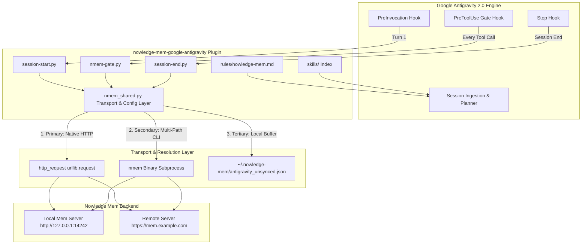
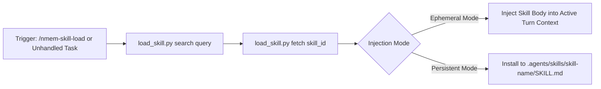

# Nowledge Mem -- Google Antigravity Plugin Architecture

This document details the internal architecture, execution dynamics, transport hierarchy, lifecycle hooks, security gating, and developer integration patterns for the `nowledge-mem-google-antigravity` plugin.

---

## 🏛️ System Architecture Overview

The plugin bridges **Google Antigravity** with **Nowledge Mem** via a hybrid multi-layer transport architecture:



---

## 🔄 Lifecycle Hook Dynamics

### 1. PreInvocation Hook (`hooks/session-start.py`)
- **Trigger**: Runs at session start (when `invocationNum == 0` or initial step).
- **Execution Flow**:
  1. Queries the Nowledge Mem backend via `nmem_shared.http_request("/context?source_app=google-antigravity")`.
  2. If Context Bundle is unavailable, falls back to `/working-memory`.
  3. Emits `injectSteps` containing a `<nowledge_context_bundle>` block into Antigravity's active session.
  4. Launches a background retry daemon (`python3 session-start.py --retry-only`) to flush any pending unsynced sessions from `~/.nowledge-mem/antigravity_unsynced.json`.

### 2. PreToolUse Gate Hook (`hooks/nmem-gate.py`)
- **Trigger**: Evaluated before executing `call_mcp_tool`, `mcp_nowledge-mem_*`, or `run_command`.
- **Policy Enforcement**:
  - **Auto-Allow**: Read-only tools (`mem_fs`, `memory_search`, `thread_search`, `query_library`, `explore_graph`, `get_memory_by_id`, etc.) return `{"decision": "allow"}` with permission overrides to prevent terminal prompt interruptions.
  - **Force Confirm**: Destructive operations (`memory_delete`, `thread_delete`, `memory_relation_delete`) return `{"decision": "force_ask"}`.
  - **Intent-Based Write Allow**: Write tools (`memory_add`, `memory_update`, etc.) check recent conversation steps for intent keywords (`save`, `remember`, `store`, `nmem`, `distill`, `handoff`). If found, returns `{"decision": "allow"}`.

### 3. Stop Hook (`hooks/session-end.py`)
- **Trigger**: Runs when the Antigravity session terminates.
- **Execution Flow**:
  1. Reads `conversationId` and `transcriptPath` from stdin.
  2. Extracts user prompts (`USER_EXPLICIT`) and model responses (`MODEL`).
  3. Checks thread existence via `HTTP GET /threads/<id>` or `nmem t show <id>`.
  4. Appends or imports the full transcript into Nowledge Mem under the conversation ID.
  5. If backend calls fail, saves the session to `~/.nowledge-mem/antigravity_unsynced.json` via file-locked append for automatic background retry.
  6. Scans for approved `learning_proposal.md` artifacts and syncs them to rules (`nmem rules upsert`), skills (`nmem skills enroll`), or memories (`nmem memories add`).

---

## ⚙️ Configuration & Path Resolution Hierarchy

### Config Resolution Order
`hooks/nmem_shared.py` resolves connection settings using the following precedence:
1. **Environment Variables**: `NMEM_API_URL` and `NMEM_API_KEY`.
2. **Client Config File**: `~/.nowledge-mem/config.json` (`apiUrl` and `apiKey`).
3. **Default Fallback**: `http://127.0.0.1:14242` (default local loopback).

### Multi-Path System Binary Resolution
To ensure subshells running inside sandboxed tool environments (`BypassSandbox: false`) can locate the `nmem` binary when user `$PATH` symlinks are hidden, `_nmem_command()` checks paths in order:
1. PATH lookup via `shutil.which("nmem")` (dereferencing symlinks to verify existence).
2. Canonical Linux package paths:
   - `/usr/lib/nowledge-mem/nmem`
   - `/usr/lib64/nowledge-mem/nmem`
   - `/usr/local/bin/nmem`
   - `/usr/bin/nmem`
   - `~/.local/share/nowledge-mem/bin/nmem-wrapper`

---

## 🚀 Interface Selection Guidelines for Agents & Developers

To minimize user prompt friction and context bloat, select the appropriate transport for each capability:

| Access Path | Recommended Surface | Rationale |
| :--- | :--- | :--- |
| **In-Session Agent Actions** | Native MCP (`mcp_nowledge-mem_*`, `mem_fs`) | Schema-validated, low latency, **does not trigger terminal permission prompts**. |
| **Knowledge Navigation** | Nowledge FS (`mem_fs`) | Path-first navigation (`/memories`, `/threads`, `/wiki`). Allows `stat` checking before `cat` windowed reading (`--line`, `--lines`). |
| **Background Hooks & Scripts** | Native Python HTTP (`nmem_shared.http_request`) | Direct REST API calls via `urllib.request` (<30ms execution) bypass subprocess spawn overhead. |
| **Diagnostics & CLI Fallback** | `nmem` CLI | Shell commands for terminal diagnostics (`nmem status`). Requires **positional arguments** (`nmem fs recall "<query>"`, `nmem fs cat "<path>"`). |

---

## 🧩 Dynamic Skill Loader Architecture (`nmem-skill-load`)

The `nmem-skill-load` skill allows Antigravity to dynamically search, preview, and load candidate/compiled skills from Nowledge Mem:



- **Slash Command**: `/nmem-skill-load <query>`
- **Proactive Discovery**: Triggered automatically when Antigravity detects an unhandled domain task (Makefile, RPM packaging, Flatpak, Docker) with an available skill definition on the Nowledge Mem server.
- **Modes**:
  - **Ephemeral Mode (Zero-Restart)**: Ingests the fetched skill body directly into the active turn context for immediate execution without writing files to disk.
  - **Persistent Mode**: Installs the skill file to `<workspace-root>/.agents/skills/<skill-name>/SKILL.md` (and appends entries to `.git/info/exclude` if requested).

---

## 🧪 Testing & Validation

Run unit tests and plugin manifest verification:

```bash
# Run hooks unit test suite
python3 -m unittest discover -s tests -p "test_*.py"

# Validate manifest, configuration files, and release assets
node scripts/validate-plugin.mjs
```
